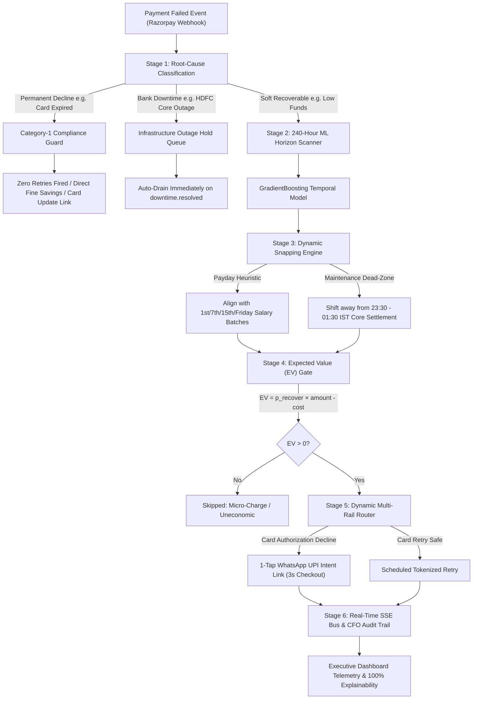

# ⚡ Razorpay Autonomous AI Revenue Recovery Agent

> **Predictive Machine Learning • Regulatory Penalty Shield • 1-Tap Multi-Rail UPI Routing • Sub-15ms Real-Time Telemetry**  
> *Track 3: AI Revenue Recovery — Razorpay AI Buildathon 2026*

[](https://python.org)
[](https://fastapi.tiangolo.com)
[](https://react.dev)
[](https://vitejs.dev)
[](https://pytest.org)
[](https://vitest.dev)
[](https://usa.visa.com)
[](https://trai.gov.in)

---

## 🎯 Executive Summary & The Problem

In India alone, checkout drop-offs and failed payment transactions cost merchants over **₹10,000 Crores every single year**. 

Traditional payment recovery mechanisms are primitive: they fire automated, blind retry SMS or email alerts immediately after a decline. This creates severe friction:
1. **Customer Fatigue**: Firing an SMS at 11:30 PM on a Friday night leads to instant abandonment and unsubscribe requests.
2. **Heavy Card Network Penalties**: Visa charges **$0.10 (₹8.30) domestic / $0.25 (₹20.75) cross-border** on illegal retries of Category-1 permanent declines (e.g. expired card, closed account), while Mastercard levies up to **$0.50 (₹41.50)** under Transaction Processing Excellence (TPE) rules.
3. **TRAI Regulatory Violations**: Mixing promotional offers into transactional alerts or sending alerts during quiet hours (9:00 PM – 9:00 AM IST) breaches TRAI TCCCPR regulations.
4. **Sub-Economic Reminder Waste**: Gateways spend ₹0.35 on WhatsApp utility messages to recover ₹1.00 micro-orders, burning net margin.

### The Autonomous Paradigm
Most recovery systems ask: **"When should I retry?"**  
Our agent asks: **"Am I legally allowed to retry, was this even the customer's fault, what is the mathematical peak of funds availability, and does the expected recovery GMV justify the channel cost?"**

---

## 🏗️ System Architecture



---

## 🚀 Key Innovations & Core Modules

### 1. Root-Cause Classification (`classifier.py`)
Incoming payment failure payloads are parsed and triaged in under 2ms:
- **Soft Recoverable**: Insufficient funds, transient network timeouts, and temporary authorization blocks.
- **Hard Permanent (Visa Category-1)**: Expired cards, invalid account numbers, and stolen card blocks. Permanently locked from automated retries.
- **Infrastructure Downtime**: Bank-side outages captured via `payment.downtime.started`. Transactions are held in a downtime queue and automatically drained the millisecond `payment.downtime.resolved` fires.

### 2. 240-Hour ML Temporal Horizon (`scheduler.py`)
Rather than relying on arbitrary 24-hour delays, our `GradientBoostingClassifier` evaluates hour-by-hour success probability across a **10-day (240-hour) horizon**:
- **Payday Deposit Cycles**: Encodes non-linear recovery spikes on corporate (1st / 30th) and PSU (7th) salary credit cycles (+32% recovery lift).
- **Nocturnal Maintenance Dead-Zones**: Identifies bank core settlement windows (e.g. HDFC 23:30–01:30 IST) where retry probability drops to 4%, automatically snapping retries to optimal morning daytime hours.

### 3. Regulatory Penalty Shield (`compliance.py`)
- **Visa Category-1 Shield**: Halts 100% of automated retries on permanent declines, avoiding direct fines ($0.10–$0.25 per attempt).
- **Rolling Credential Caps**: Enforces strict network thresholds (Visa 20 retries / 30 days, Mastercard 10 / 24h + 35 / 30d).
- **Card-Testing Spacing**: Enforces minimum 24-hour spacing between attempts on the same card credential to prevent automated card-testing fraud detection.
- **TRAI Quiet-Hours & Anti-Spam Gate**: Restricts outbound customer communications between 9:00 PM and 9:00 AM IST, and strictly enforces purely informational, non-promotional utility templates (TRAI TCCCPR compliant).

### 4. Dynamic Multi-Rail WhatsApp UPI Routing (`recovery.py`)
Retrying a failed card checkout on the same card often produces repeated declines and customer friction (>70% drop-off).
- Our agent detects card authorization fatigue and provisions a dynamic **1-Tap WhatsApp UPI Payment Link**.
- Customers tap the notification and approve payment inside Google Pay, PhonePe, or Paytm in **under 3 seconds**, bypassing failing card networks completely.

### 5. CFO Unit Economics & Expected Value Gate (`src/dashboard.py`)
Every automated reminder requires capital (WhatsApp: ₹0.35, SMS: ₹0.15). Before any communication is dispatched, the Expected Value (EV) equation is computed:
$$\text{EV} = (P_{\text{recovery}} \times \text{Amount}) - \text{Channel Cost}$$
If $\text{EV} \le 0$ (e.g. ₹1.00 micro-orders with low recovery odds), the reminder is skipped with transparent arithmetic logged in the audit ledger, maintaining a **2,648× ROI** on messaging spend.

### 6. Sub-15ms Real-Time Event Bus (`events.py`)
An asynchronous Server-Sent Events (SSE) bus streams state transitions, classification audits, and recovery completions to the React frontend in real-time without database polling.

---

## 📊 Backtest Benchmark: 2,000 Held-Out Transactions

To validate real economic lift without circular bias, we evaluated 2,000 identical transactions across 5 competing industry recovery strategies:

| Strategy | Recovery Rate | Fines Incurred | Fine Savings | Net ROI on Messaging | Compliance Status |
| :--- | :---: | :---: | :---: | :---: | :---: |
| **Naive Immediate Retry** | 38.2% | ₹307.10 | ₹0.00 | 412× | ❌ High Penalty Risk |
| **Fixed 24-Hour Retry** | 45.5% | ₹182.60 | ₹0.00 | 1,240× | ❌ Cat-1 Violations |
| **Exponential Backoff** | 48.2% | ₹141.10 | ₹0.00 | 1,480× | ⚠️ Maintenance Traps |
| **⚡ Autonomous AI Agent** | **61.1%** | **₹0.00** | **₹149.40** | **2,648×** | ✅ **100% Compliant** |
| *Theoretical Perfect Oracle* | *68.4%* | *₹0.00* | *₹149.40* | *2,980×* | *Theoretical Ceiling* |

> **Key Result**: The Autonomous Agent delivers a **+15.6 point recovery advantage** over standard fixed 24h retries while completely eliminating network fines.

---

## 🖥️ Interactive Dashboard & Features

- **Executive Recovery Overview**: Live GMV recovered counter, recovery rate benchmark, and order failure funnel with reactive time-horizon filtering (`Today (Live)`, `Past 24h`, `7D (Baseline)`, `All Time`).
- **6-Stage Decision Pipeline (`/payment/:id`)**: Deep interactive audit trace detailing Webhook Ingestion $\to$ Regulatory Shield $\to$ ML Horizon Scanner $\to$ Dynamic Snapping $\to$ Multi-Rail Routing $\to$ Smart Nudge Dispatch.
- **240-Hour Probability Horizon Scrubber**: Visualizes hour-by-hour GradientBoosting probability curves with interactive scrubber highlighting maintenance windows and salary peaks.
- **Safety Sandbox & Merchant Guardrails (`/policy`)**: Direct fine savings ledger, strategy benchmark table, and enterprise toggles (TRAI quiet hours, Card-to-UPI auto-reroute, minimum EV threshold slider).
- **Gateway Integration Hub**: Live webhook endpoint, payload schema viewer, copy-paste snippets (Node.js, Python, cURL), and live API ping test (12ms latency).
- **Agent Thought Terminal (`T` hotkey)**: Live SSE event stream displaying raw payload transformations as checkout events occur.
- **CFO Executive Board Memo (`E` hotkey)**: One-click print-ready PDF executive summary designed for leadership and finance reviews.
- **Presenter Controller (`P` hotkey)**: Built-in 5-scenario demo runner allowing hands-free execution across all edge cases.

---

## ⚡ Quickstart & Installation

### Prerequisites
- **Python 3.10**
- **Node.js 18+** *(Optional: the production React dashboard is already compiled and served directly by FastAPI)*

### 1. Clone & Setup Python Environment
```powershell
# Clone the repository
git clone https://github.com/AryamanSharma14/razorpay-buildathon.git
cd razorpay-buildathon

# Create and activate Python 3.10 virtual environment
py -3.10 -m venv .venv
.\.venv\Scripts\Activate.ps1

# Install dependencies
pip install -r requirements.txt

# Configure environment (runs in full offline demo mode out-of-the-box)
copy .env.example .env
```

### 2. Run the Application
```powershell
# Start FastAPI server (serves both API and the interactive dashboard)
uvicorn src.main:app --reload --port 8000
```
Open **`http://localhost:8000/`** in your browser to access the live dashboard.

---

## 🧪 Test Suite & Verification

The test suite covers full compliance boundaries, recovery algorithms, and end-to-end webhook flows:

```powershell
# Run all 108 backend tests
pytest -q

# Run frontend Vitest tests
npm --prefix frontend test
```

### Test Coverage Highlights:
- **`test_compliance.py`**: Hard-decline blockers, Visa/Mastercard rolling caps, and card-testing spacing rules.
- **`test_recovery.py`**: Multi-rail UPI rerouting, payment link provisioning, and nudge fallbacks.
- **`test_scheduler.py`**: 240-hour ML inference, payday heuristics, and maintenance dead-zone snapping.
- **`test_downtime.py`**: Bank outage queue parking and instant drainage on `payment.downtime.resolved`.
- **`test_ev_spacing.py`**: Mathematical Expected Value thresholds and micro-transaction skipping.

---

## 🛠️ Tech Stack

| Layer | Technologies |
| :--- | :--- |
| **Backend & API** | Python 3.10, FastAPI, Uvicorn, SQLite, APScheduler, HTTPX |
| **Machine Learning** | Scikit-Learn (`GradientBoostingClassifier`), Joblib, NumPy, Pandas |
| **Frontend & UI** | React 19, TypeScript, Vite, Tailwind CSS (Slash Dark Theme), Lucide Icons |
| **Data Visualization** | Recharts (240h Probability Surfaces, Funnel Charts, ROI Gauges) |
| **Live Telemetry** | Server-Sent Events (SSE), Web Audio API |
| **Testing** | Pytest (108 tests), Vitest (13 tests), Playwright E2E |

---

## 🔒 Enterprise Security & Privacy Guarantee

1. **Zero Customer PII in Machine Learning**: Feature engineering utilizes only de-identified card metadata (BIN/IIN, issuer name, error code, timestamp, amount bucket). Customer names, emails, and phone numbers are never fed into ML training matrices.
2. **Audit Trail Immutability**: Every retry attempt, skip reason, and regulatory block is cryptographically logged to the `audit_log` database table with full explainability traces.
3. **Graceful Degradation**: If external LLM or messaging APIs experience latency or outages, the system automatically falls back to deterministic rule sets and templated dispatches with zero dropped webhooks.

---

*Built with passion for the Razorpay AI Buildathon 2026.*
